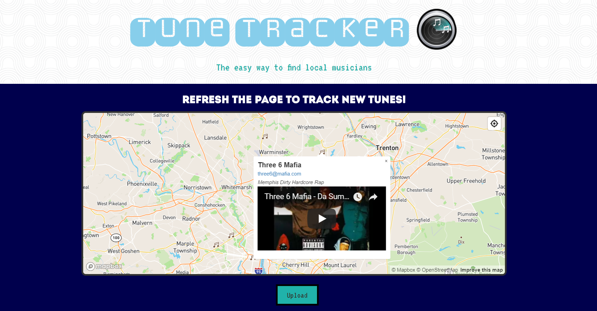

# Map-Based App for Local Musicians

 [View Live!](https://bereznd1.github.io/TuneTracker/) 

## Brief Description

The purpose behind this app is to bring local musicians together based on their locations, to be able to contact one another and collaborate.

The app allows artists to submit their name, email address, a YouTube link to their work, and a brief description of their music, which is then stored in a **Firebase** database. Their browser picks up on their current location & creates a marker on a map (which is loaded through the **Mapbox** API onto the page) at the exact coordinates from which the artist submitted his/her music. When this marker is clicked, a pop-up appears with the artist's information & an embedded iFrame that contains their YouTube video. Other users who load up the app can navigate to their own locations using the Geolocation feature, or scroll around on the map wherever else they may please, and view the music that has been submitted. If they find somebody whose work impresses them, they can click that person's email address & get in touch in order to collaborate. 

## Technologies Used

* **Mapbox API** - the main API that is called to load up the map & place markers/popups on it 
* **YouTube iFrame API** - the API that is used to embed users' submitted YouTube clips as iFrames within each popup
* **Firebase** - the database service that is used to store users' submissions
* **Velocity JS** - JavaScript library that is used to create slick animations within the UI
* **jQuery** - JavaScript library that is used to simplify DOM manipulation
* **Bootstrap** - CSS framework that is used to make page layout/design easier